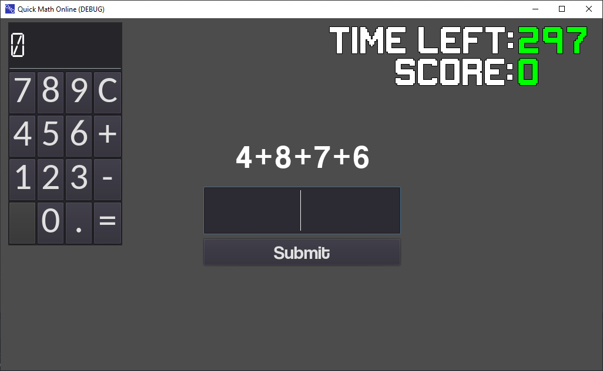

# CalcTask
A calculator task wrtitten in Godot.
  
The purpose of this experiment was to see if we could model tool use given a cost. In this case the cost is the calculator delay which a server randomizes to 3 or 5 seconds.
  
The current repository contains only the stimulus and analysis code. If anybody wants it, I can send the server code. This experiment was deployed online and utilized a Rock Pi 4c as a webserver for the HTML/WASM game and a Raspberry Pi 4 as the WebSocket server to communicate with the client.
  
I came up with the initial idea and wrote up the experiment, but this was a group project for a course and my teammates were vital in iterating over the design of the experiment. 
The overall group was: Dan Acosta-Kane, Ollie D'Amico (me),  Aiden Iveris, and Harshada Yadav.
  
The calculator was adapted from: https://github.com/Parka/simple-godot-calculator
  

